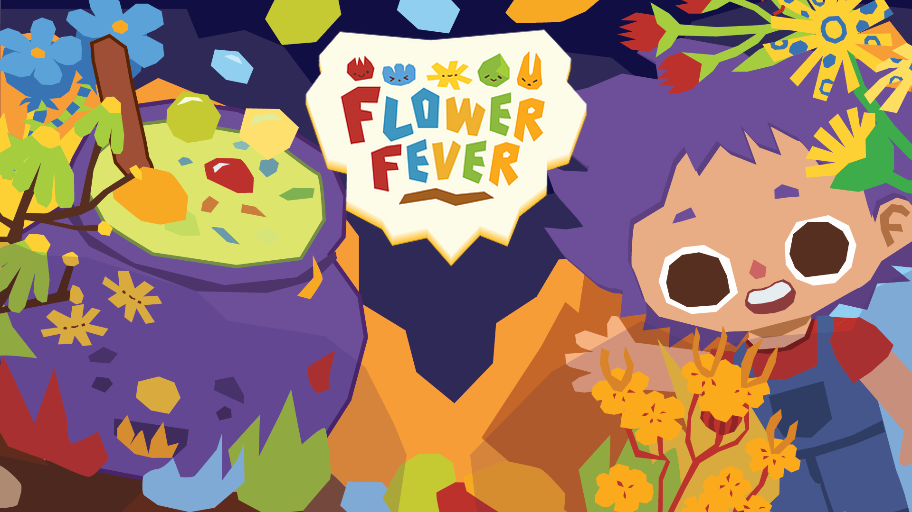
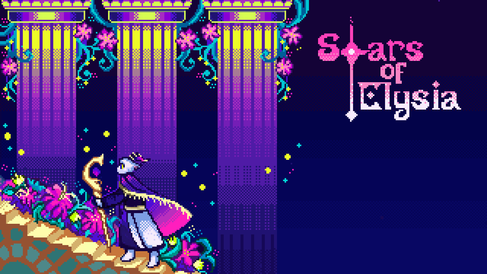
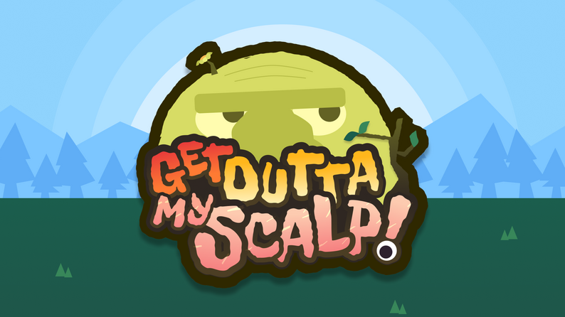
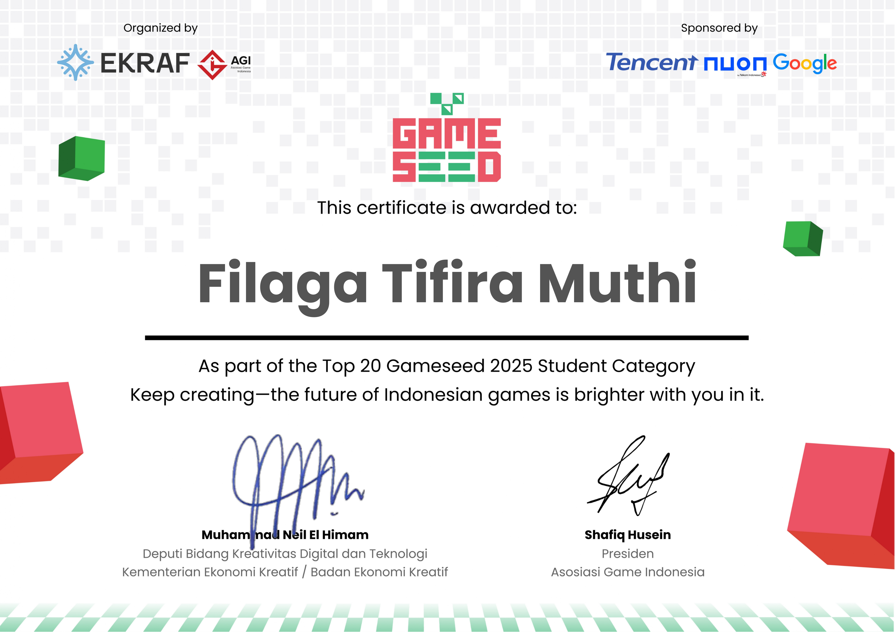

# Gameplay Programmer

I am a Computer Engineering student at Universitas Indonesia with a passion for creating engaging gameplay experiences using Unity and C#.

I've participated in three Game Jams (2024–2026), collaborating with multidisciplinary teams to develop complete, playable games under tight deadlines. My core interests include gameplay programming, UI systems, scene management, and game polish.

---

## Projects

### Flower Fever

<iframe width="100%" height="315" src="https://www.youtube.com/embed/_yc2BMNI3qM" frameborder="0" allow="accelerometer; autoplay; clipboard-write; encrypted-media; gyroscope; picture-in-picture" allowfullscreen></iframe>

**Overview:** 
A chaotic, *Overcooked*-inspired multitasking game! You are tasked with growing flowers and brewing medicines following a recipe book to cure customers of various conditions. Optimize your workflow to treat as many patients as possible and get the highest score!

**Role:** Gameplay Programmer

**Contributions**
- Implemented gameplay UI and HUD
- Developed menus and settings interface
- Implemented World Space UI for gameplay elements
- Integrated sound effects into gameplay
- Integrated background music
- Assisted with gameplay polish and bug fixing

**Technologies:** Unity • C#

🔗 **[itch.io](https://fakesnowy.itch.io/flower-fever)**

---

### Stars of Elysia

<iframe width="100%" height="315" src="https://www.youtube.com/embed/4yvRDsAAlWg" frameborder="0" allow="accelerometer; autoplay; clipboard-write; encrypted-media; gyroscope; picture-in-picture" allowfullscreen></iframe>

**Overview:** 
A top-down boss-rush story game blending turn-based strategy with intense bullet hell action. You play as Astrologer Cygnia, harnessing the ancient powers of the 12 constellations to push back the rising chaos. Standing in your way is Ophiuchus, the jealous and corrupted lost 13th constellation, who seeks to rewrite the stars.

**Role:** Gameplay Programmer

**Contributions**
- Implemented gameplay UI and HUD
- Developed menus and settings interface
- Integrated game audio
- Created and implemented sound effects
- Integrated background music
- Assisted with gameplay polish and testing

**Technologies:** Unity • C#

🔗 **[itch.io](https://fakesnowy.itch.io/166-muffin-wizards-student-stars-of-elysia)**

---

### Get Outta My Scalp

<iframe width="100%" height="315" src="https://www.youtube.com/embed/xf-_bgC8bKQ" frameborder="0" allow="accelerometer; autoplay; clipboard-write; encrypted-media; gyroscope; picture-in-picture" allowfullscreen></iframe>

**Overview:** 
A unique base-building survival game where you play as unwanted parasites living on a giant's head. Your goal is to build structures to generate passive income and rack up the highest score possible before being evicted. You cannot fight back; instead, you must carefully manage and slow down the giant's ever-rising frustration to survive as long as you can!

**Role:** Audio Designer

**Contributions**
- Composed the original background music
- Created sound effects
- Managed the project's audio implementation and balancing

**Technologies:** Unity • C#

🔗 **[itch.io](https://staryo40.itch.io/get-outta-my-scalp)**

---

## Achievements

- **Top 20** - GameSeed Student Category 2025
   

---